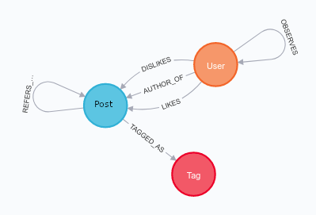

# MiniSocialNetwork

Portal społecznościowy będący okrojonym klonem Twittera: użytkownicy posiadają możliwość tworzenia wpisów, obserwowania innych użytkowników, oceniania wpisów.
Informacje dot. użytkowników, postów, obserwowania przechowywane w bazie Neo4j. Frontend napisany w Angularze. Backend w Pythonie i Flasku.

## Członkowie grupy

- Gabriel Kępka
- Piotr Makarewicz

## Przewodnik po kodzie

Kod źródłowy składa się z trzech folderów. Każdy z nich jest niezależnym programem.

- backend
- frontend
- generator

Poszczególne programy mają swoje instrukcje uruchomienia we własnych folderach, w plikach README.md.

## Uruchomienie i testowanie projektu

Aby uruchomić i przetestować projekt, należy najpierw wypełnić bazę Neo4j za pomocą generatora. Do bazy trzeba dodać plugin "Graph Data Science Library", aby móc skorzystać z algorytmu PageRank. Następnie należy uruchomić backend i na końcu frontend. We frontendzie należy się zalogować z nazwą użytkownika "Userof Minisocialnetwork" i hasłem "password".

## Model bazy danych

### Węzły

- User - użytkownik
- Post - wpis
- Tag - hasztag

### Relacje

- (User) - AUTHOR_OF -> (Post) - określa autorstwo wpisu
- (User) - OBSERVES -> (User) - użytkownik obserwuje innego użytkownika
- (User) - LIKES -> (Post) - użytkownik lubi wpis
- (User) - DISLIKES -> (Post) - użytkownik nie lubi wpisu
- (Post) - REFERS_TO -> (Post) - wpis odnosi się do innego wpisu
- (Post) - TAGGED_AS -> (Tag) - wpis został oznaczony tagiem

### Atrybuty węzłów

#### User

- name
- creation_datetime
- avatar
- description
- role
- password_hash

#### Post

- creation_datetime
- update_datetime
- content
- photo_adress

#### Tag

- name

### Atrybuty relacji

#### (User) - OBSERVES -> (User)

- since

#### (User) - LIKES -> (Post)

- datetime

#### (User) - DISLIKES -> (Post)

- datetime
